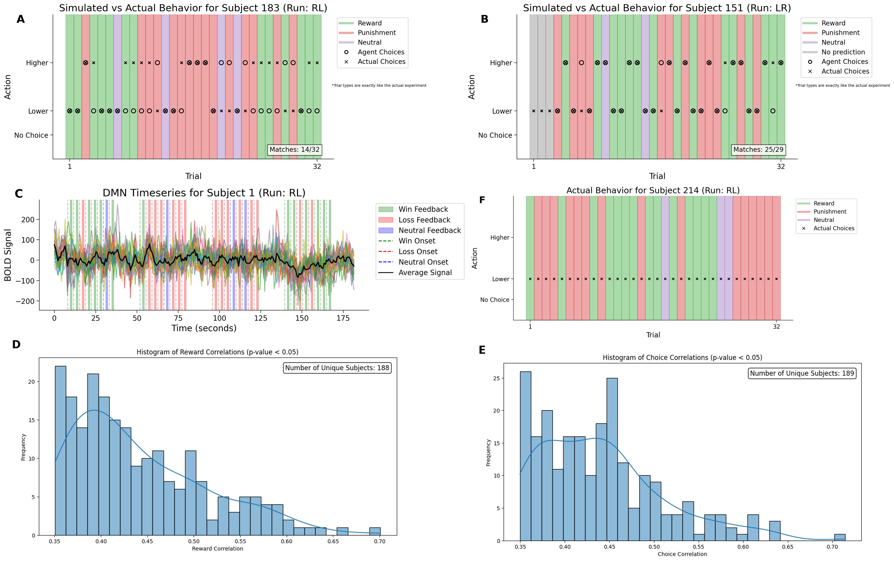

# Understanding the Default Mode Network's Computational Role in Decision-Making

## Abstract
Understanding the neurobiological mechanisms of decision-making, especially in uncertain environments, remains a challenge in cognitive neuroscience. This study examines the role of Default Mode Network (DMN) in decision-making, focusing on how past rewards and choices shape future behavior. Using fMRI data from the Human Connectome Project gambling (HCP) task, we modeled behavior with a reinforcement learning model called the Experience-Weighted Attraction (EWA) model and a logistic regression model. The EWA model, which updates action values based on past experiences, showed inconsistent performance, whereas the logistic regression model, predicting choices from past rewards and choices, better captured behavioral patterns. We analyzed DMN activity during the pre-feedback period, using regression models with predictors derived from past rewards and choices, revealing its relationship with prior feedback and decisions. However, constraints associated with the HCP gambling task highlight the need for dynamic paradigms, such as probabilistic reversal learning, to better investigate adaptive decision-making.

## Description
Our previous project investigated the role of the Default Mode Network (DMN) in risky decision-making, particularly in gambling scenarios. By analyzing fMRI time series data from the Human Connectome Project (HCP), we compared the predictive performance of a generalized linear model (GLM) and a long short-term memory (LSTM) neural network to determine which provided more accurate predictions of gambling outcomes. This study aimed to enhance our understanding of the DMN’s influence on high-stakes decision-making and its underlying neurobiological mechanisms.
In the present work, we aim to better understand how individuals make decisions based on past feedback and choices. We examine whether decision-making can be accurately modeled using historical reward and choice data, while accounting for the role of the DMN network in value estimation. For this purpose, we focus on the curated HCP dataset from NeuroMatch Academy, which includes 339 subjects. The HCP gambling task, a widely used behavioral paradigm, assesses decision-making under uncertainty. Participants guessed whether a hidden number behind a virtual card was greater or less than 5, earning $1.00 for correct answers and losing $0.50 for incorrect ones. A neutral outcome occurred if the number 5 was revealed. Trials followed a fixed outcome with predetermined types (reward, loss, neutral), designed to test risk-based decision-making with real-time feedback in a balanced, randomized sequence (Delgado et al., 2000).
We applied a reinforcement learning model called Experience-Weighted Attraction (EWA) to simulate participant behavior and optimize model parameters based on observed choices and feedback (Camerer & Hua Ho, 1999). The model updates the expected values (Q-values) for each action based on past experiences and received feedback, guided by the learning rate (α), sensitivity to expected value differences (β), and the experience weight (φ). The model utilizes a softmax decision rule to simulate choice behavior, where the probability of choosing an action is determined by the relative Q-values of the actions, adjusted by the β parameter. This decision rule is given by the following equation:  
$$P(a)=\frac{\exp(\beta Q(a))}{\sum_{a'}{\exp(\beta Q(a'))}}$$  
where 𝑃(𝑎) is the probability of choosing action 𝑎, and 𝑄(𝑎) represents the expected value of action aa. The action with the higher Q-value is more likely to be chosen, with randomness introduced based on the temperature parameter β. The Q-values themselves are updated after each trial, with the learning rule governing this update based on the feedback 𝑟 received from the environment. The update rule for each action is as follows:  
$$Q(a) \leftarrow Q(a) + \alpha \cdot (r-Q(a))$$  
where α is the learning rate, 𝑟 is the feedback received for the chosen action, and 𝑄(𝑎) is the current expected value of action 𝑎. This equation adjusts the expected value toward the received reward (or penalty) while also maintaining a balance with prior expectations (Rescorla & Wagner, 1972). Additionally, our model incorporates experience weights to account for the influence of previous choices on future behavior. These weights are updated after each trial according to the following equation:  
$$w_a \leftarrow (1-\phi) \cdot w_a + \phi \cdot I(a)$$  
where 𝑤𝑎 is the experience weight for action 𝑎, φ controls the degree to which past choices
influence future decisions, and 𝐼(𝑎) is an indicator function that takes the value of 1 if action a was chosen in the previous trial, and 0 otherwise. This ensures that the experience weight for the chosen action increases over time, reflecting the reinforcement of actions that were selected. To fit the model to participant data, the parameters α, β, and φ were optimized by minimizing the error between the model’s predicted choices and the actual observed choices. The error was computed by comparing the predicted choices generated from the updated Q-values, with the actual choices made by participants. A standard optimization algorithm was employed to find the parameter values that best minimize this error. In this case, the EWA model was ineffective due to a high degree of variability caused by the random initialization of the model parameters, leading to significantly different outcomes with every run. The parameters crucial for the model’s behavior should not be overly dependent on their initial values. Furthermore, by simulating the agent's choices and comparing them to those of the real subject, we observed that the similarity between the simulated and actual choices was low (Figure 1A). The model struggled to accurately capture the real subject’s response patterns, indicating that the reinforcement learning agent was not effectively mimicking the real subject's decision-making behavior.
To overcome the EWA model’s limitations, we explored an alternative approach using logistic regression to model the decision-making process. This method (Katahira, 2015) predicts a subject's choice based on their reward and choice history from previous trials. In our model, reward history 𝑟(𝑡) is defined such that 𝑟(𝑡) = 1 for the reward trials, 𝑟(𝑡) = 0.5 for the neutral trials, and 𝑟(𝑡) = 0 for the loss trials. Similarly, the choice history 𝑐(𝑡) is defined as 𝑐(𝑡) = 1 when option 1 is chosen and 𝑐(𝑡) = 0 when option 2 is chosen.
The regression model predicts choices using the equation  
$$h(t)=\sum_{m=1}^{M_r}{b_r(m)r(t-m)} + \sum_{m=1}^{M_c}{b_c(m)c(t-m)}$$  
where 𝑏𝑟(𝑚) and 𝑏𝑐(𝑚) represent the regression coefficients for reward and choice history,
respectively, and 𝑀𝑟 and 𝑀𝑐 denote the length of history considered for each. This approach
optimizes the coefficients using the maximum likelihood method to minimize prediction errors.
This model adopts logistic regression with a logit link function, $$P(a(t)=1) = \frac{1}{1+\exp(-h(t))}$$ (Katahira, 2015). We chose 𝑀𝑟 = 𝑀𝑐 = 3, as this value represents a practical balance between
model complexity and realism. Although increasing these variables could potentially improve the model's ability to capture behavioral patterns, it is unlikely that subjects are influenced by trials as far back as 5 or more. From a practical standpoint, considering the last three trials provide a more realistic approximation of human decision-making processes. This model, although not applicable to all subjects, demonstrates an overall better ability to simulate subject choices compared to the EWA model (Figure 1B). As a result, the parameters derived from this logistic regression approach are more suitable for comparison to brain signals.
To compare the model coefficients with brain signals, we employed a method inspired by previous works in the field (Daw et al., 2011; Kable & Glimcher, 2007). Specifically, we focused on calculating the brain's average DMN activity during the pre-feedback periods (Figure 1C) and regressing these signals against the model's predictors, which were derived from the history of past rewards and choices. This regression approach allowed us to evaluate the extent to which brain activity during the pre-feedback period was influenced by previous trial outcomes and cognitive processes associated with decision-making. By comparing the coefficients of the regression model, we assessed how well the past rewards and choices could explain the variations in the brain's activity, particularly within the DMN.
Results show that a subset of subjects exhibited a positive correlation, though not necessarily substantial, between their DMN activity and either given feedback (Figure 1D) or their choices (Figure 1E). This suggests that the DMN likely plays a crucial role in evaluating the outcomes of past decisions and using that feedback to adjust future behavior. This could involve tracking how previous choices led to rewards or punishments and incorporating this information into the decision-making process for future actions. The DMN has been proposed to be involved in the implicit computation of future choices, where it explores candidate actions and estimates cumulative reward outcomes (Dohmatob et al., 2020).
 

One limitation of our study is the use of the average DMN signal across the entire network, which may overlook the unique contributions of different DMN regions to decision-making and learning. Future research could examine each region separately to refine our understanding and improve model accuracy.
Another limitation is that the HCP gambling task may not fully engage participants in meaningful decision-making, as shown by repetitive choice patterns (Figure 1F). This suggests a lack of motivation to optimize outcomes, hereby limiting the task's utility for studying adaptive decision-making processes. We recommend using probabilistic reversal learning tasks in future studies, as they involve adapting to changing reward contingencies and offer deeper insights into decision-making and learning (Zühlsdorff et al., 2023).

## Acknowledgements
We warmly thank Manu Raghavan Pullur and Julia Plenert, our dear team members from the previous project, for their incredible work, which inspired and set the stage for this study.

## References
- Berezka, K.M.., Kovalchuk, O.Y.., Banakh, S.V.., Zlyvko, S.V.. & Hrechaniuk, R. A (2022). Binary Logistic Regression Model for Support Decision Making in Criminal Justice. Folia Oeconomica Stetinensia, 22(1), 1-17. doi.org/10.2478/foli-2022-0001
- Camerer, C., & Hua Ho, T. (1999). Experience‐weighted attraction learning in normal form games. Econometrica, 67(4), 827-874.
- Daw, N. D., Gershman, S. J., Seymour, B., Dayan, P., & Dolan, R. J. (2011). Model-based influences on humans’ choices and striatal prediction errors. Neuron, 69(6), 1204-1215. doi: 10.1016/j.neuron.2011.02.027
- Delgado, M. R., Nystrom, L. E., Fissell, C., Noll, D. C., & Fiez, J. A. (2000). Tracking the Hemodynamic Responses to Reward and Punishment in the Striatum. J Neurophysiol, 84(6), 3072-7. doi: 10.1152/jn.2000.84.6.3072
- Dohmatob, E., Dumas, G., & Bzdok, D. (2020). Dark control: The default mode network as a reinforcement learning agent. Hum Brain Mapp, 41(12), 3318–3341. doi: 10.1002/hbm.25019
- Kable, J., & Glimcher, P. (2007). The neural correlates of subjective value during intertemporal choice. Nat Neurosci, 10, 1625–1633. doi: 10.1038/nn2007
- Katahira, K. (2015). The relation between reinforcement learning parameters and the influence of reinforcement history on choice behavior. Journal of Mathematical Psychology, 66, 59–69. doi: 10.1016/j.jmp.2015.03.006
- Kavelaars, X., Mulder, J., & Kaptein, M. (2024). Bayesian Multivariate Logistic Regression for Superiority and Inferiority Decision-Making under Observable Treatment Heterogeneity. Multivariate Behavioral Research, 59(4), 859–882. doi.org/10.1080/00273171.2024.2337340
- Rescorla, R. A., & Wagner, A. R. (1972). A theory of Pavlovian conditioning: Variations in the effectiveness of reinforcement and nonreinforcement. Classical Conditioning II: Current Research and Theory.
- Zühlsdorff, K., Verdejo-Román, J., Clark, L., Albein-Urios, N., Soriano-Mas, C., Cardinal, R. N., Robbins, T. W., Dalley, J. W., Verdejo-García, A., & Kanen, J. W. (2023). modelling of reinforcement learning and functional neuroimaging of probabilistic reversal for dissociating compulsive behaviours in gambling and cocaine use disorders. BJPsych open, 10(1). doi: 10.1192/bjo.2023.611
